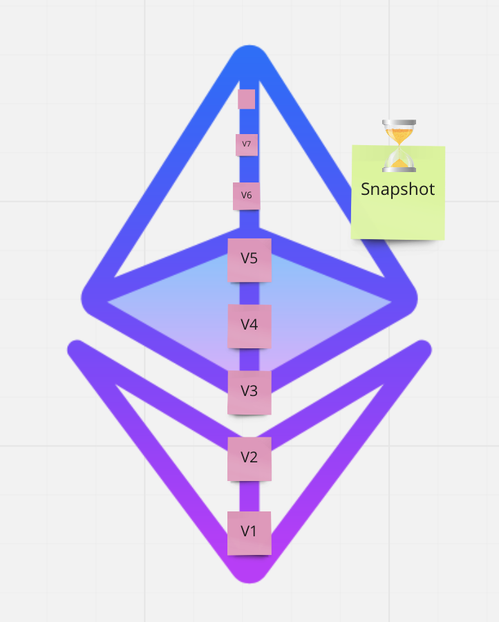

# 1 MAN 1 VOTE 

Tribute to Nelson Mandela famous quote : "One Man, One Vote".
The idea is to let every person holding 1man1vote tokens to have the right to vote using ERC777 token. 


### Inspiration 

[ERC777-VotingSystem](https://hackernoon.com/i-built-an-ethereum-based-fully-decentralized-voting-system-5x8t34gz)

### Problem 

 - Sybil attack resilience — it is hard to keep track of valid voters.
 - High fees to express an opinion. 
 - Scalability : using a "list" of voters could be very expensive if we consider a country with millions of voters 
 - token holders don't have real "control" over their tokens.
 - Malicious person can send tokens to another address and vote again and again with his power rights 

### Solution 




### Smart contract 

- send tokens to a contract and notify it in a single transaction with ERC777
- Use a granularity of 10 minimum tokens minted/burned for voting to respect our specified points which listed in the rules of 1man1vote 

Logic :

We will split the voting into 3 trusted Operators : 

- Right voters
- Left voters
- Middle voters 

To reduce the weight of paying gas to the voters, they will not send tokens to the contract and will have an Trusted Operator handling that for them.
In other words, all you have to do to vote is choose an Operator and authorize him with ```authorizeOperator``` function. 
But the Operator can be corrupted,  or someone unknow like Satoshi Nakamoto. To resolve this issue, we are using WorldCoin to identify the 3 operators as humans. This is a main feature in the process and very important. The "Doxed" reputation is not a proof of person and can't apply for those important events. WorldCoin is a major feature as it allows to fight corruption in this case. 

### Aditional features 


